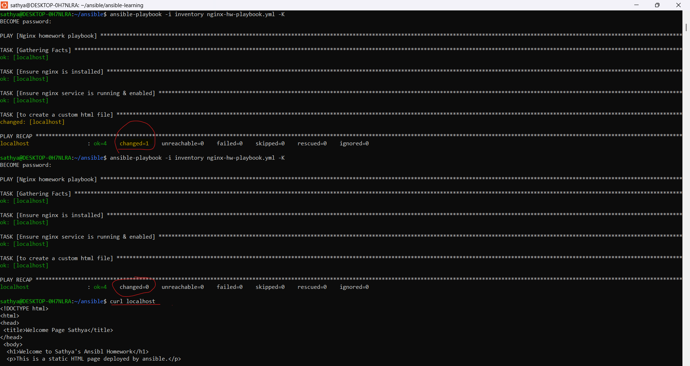

# Ansible Learning – Basics

## Topics Covered
- Ansible installation (Ubuntu / WSL)
- Control node vs Managed node
- Inventory configuration (project-level)
- Ansible ping module
- Ad-hoc commands
- Package installation using Ansible
- Idempotency validation

## Concepts Practiced
- Idempotency in Ansible
- Declarative configuration management
- Difference between ad-hoc commands and playbooks
- Service management using modules (apt, service, copy)
- Privilege escalation using become

## Commands Used

### Ping Test
```bash
ansible -i inventory test -m ping
```
Install Nginx
```
ansible -i inventory test -m apt -a "name=nginx state=present update_cache=yes" --become -K
```
Outcome

Successfully automated nginx installation

Verified idempotent behavior (changed: false)

# Ansible Playbook – Nginx Automation
📄 Playbook: nginx-hw-playbook.yml

Purpose:
Automate the installation and basic configuration of an Nginx web server using Ansible.

What the playbook does:

Installs the nginx package using the apt module

Ensures the nginx service is running and enabled on boot

Deploys a custom static HTML page to /var/www/html/index.html

Demonstrates Ansible idempotency by producing no changes on repeated runs

How to run the playbook:
ansible-playbook -i inventory nginx-hw-playbook.yml -K

## Idempotency Validation:

First run: required resources are created (changed=1)

Second run: no changes detected (changed=0)

Verification:
curl localhost


# Ansible Variables & Loops

📄 Playbook: nginx-vars-loop-playbook.yml

What it demonstrates:
- Using variables to define package lists
- Installing multiple packages using loops
- Clean, reusable playbook design

Example:
Packages like nginx, git, curl, vim, tree were installed using a loop.

## Advanced Ansible Concepts Practiced

- Handlers and notify for conditional service restarts
- Variables for reusable and flexible playbooks
- Jinja2 templates for dynamic configuration files
- Conditional execution using `when`
- Looping over multiple packages using `loop`
- Role-based project structure for scalability
- Centralized playbook execution using site.yml

## Handlers and Service Management

This project demonstrates the use of Ansible handlers to safely manage services.

- Services are restarted only when a dependent task reports a change
- Prevents unnecessary restarts and avoids service disruption
- Follows production best practices for configuration management

Example use case:
- Restart nginx only when configuration or content changes

## Templates with Jinja2

- Used Jinja2 templates to deploy dynamic HTML content
- Enables variable-driven content rendering
- Ensures idempotent deployment of configuration files

Verified using:
curl localhost

## Ansible Roles and Project Structure

Implemented Ansible roles to organize tasks, handlers, and templates.

Structure:
roles/
└── nginx/
    ├── tasks/
    ├── handlers/
    └── templates/

- Improved reusability and maintainability
- site.yml used as the main entry point to apply roles
- Follows industry-standard Ansible project layout

## Learning Outcome

- Built end-to-end Ansible automation using both ad-hoc commands and playbooks
- Applied idempotency principles across all tasks
- Implemented handlers for safe service restarts
- Used variables, loops, conditionals, and templates for flexibility
- Structured automation using roles and site.yml
- Gained confidence in writing production-aligned Ansible code

## Learning Status
✔ Ansible Basics  
✔ Inventory & Modules  
✔ Playbooks & Idempotency  
✔ Variables & Loops  
⏳ Roles, Templates, Handlers (In Progress)

💡 This repository represents my hands-on Ansible learning journey, focusing on real-world automation, best practices, and clarity.
